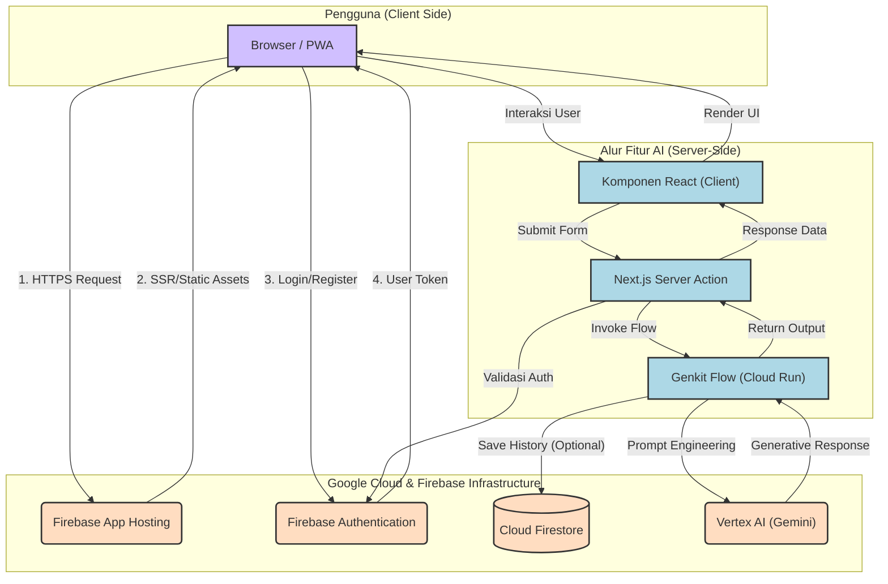
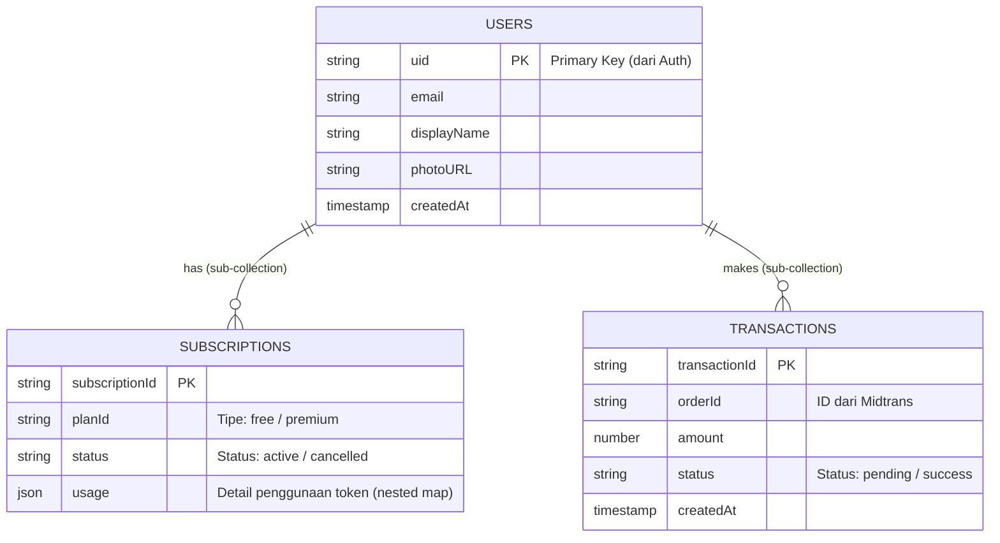

# Learniverse: Asisten Belajar Cerdas Bertenaga AI

Selamat datang di Learniverse, sebuah platform inovatif yang dirancang untuk memberdayakan siswa dan akademisi dengan seperangkat alat canggih berbasis kecerdasan buatan (AI). Misi kami adalah untuk mengatasi berbagai tantangan akademis, mempercepat proses belajar, dan membantu pengguna mencapai potensi penuh mereka.

Aplikasi ini dibangun oleh **Revan (Eka Revandi)**, seorang Cloud Architect dan Software Engineer yang bersemangat dalam menggabungkan teknologi cloud dan AI untuk menciptakan solusi pendidikan yang transformatif.

## ✨ Fitur Unggulan

Learniverse dilengkapi dengan berbagai fitur cerdas yang dirancang khusus untuk mendukung berbagai kebutuhan akademis, mulai dari tahap awal pencarian ide hingga penyelesaian tugas akhir.

### 🧠 Katalisator Ide & Kreativitas
- **Brainstorm Topik**: Menghasilkan ide sub-topik yang menarik dari sebuah tema umum.
- **Kerangka Presentasi**: Mengubah judul menjadi kerangka slide yang logis dan terstruktur.
- **Pencari Analogi**: Menyederhanakan konsep teknis yang rumit menjadi lebih mudah dipahami.
- **Roadmap Belajar**: Membuat roadmap belajar terstruktur untuk menguasai keterampilan baru.
- **Pembuat Pertanyaan**: Menghasilkan daftar pertanyaan dari materi pelajaran untuk kuis atau diskusi.

### 📚 Asisten Riset & Penulisan
- **Kerangka Penelitian**: Membuat draf kerangka skripsi atau tesis sesuai standar akademis.
- **Pencari Referensi Cerdas**: Memberikan rekomendasi kata kunci alternatif untuk riset literatur.
- **Parafrase Akademik**: Menyusun ulang kalimat untuk menghindari plagiarisme dengan tetap menjaga makna.
- **Peringkas Jurnal & Dokumen**: Meringkas artikel atau dokumen (PDF/Word) ke dalam Bahasa Indonesia.
- **Jawaban Cepat**: Mengunggah dokumen soal (PDF/JPG) dan membiarkan AI menjawabnya.

### 🎓 Asisten Profesional & Personal
- **Tutor AI**: Bertanya jawab dengan AI berdasarkan konteks materi kuliah yang diunggah.
- **CV Reviewer**: Mendapatkan ulasan, skor, dan saran perbaikan untuk CV dari AI yang bertindak sebagai HR.
- **Code Review**: Menjalankan kode (JavaScript), dan jika terjadi error, AI akan menjelaskan masalah serta solusinya.

## 🚀 Tumpukan Teknologi (Tech Stack)

Aplikasi ini dibangun di atas tumpukan teknologi modern yang berfokus pada kinerja, skalabilitas, dan pengalaman pengembang.

- **Framework Utama**: **Next.js (App Router)** & **React** - Untuk membangun antarmuka pengguna yang cepat dan responsif dengan Server-Side Rendering (SSR) dan Static Site Generation (SSG).
- **Bahasa**: **TypeScript** - Untuk memastikan keamanan tipe dan meningkatkan kualitas kode.
- **Styling**: **Tailwind CSS** & **Shadcn/UI** - Untuk desain yang konsisten, modern, dan dapat disesuaikan.
- **Manajemen Form**: **React Hook Form** & **Zod** - Untuk validasi skema dan formulir yang andal.
- **AI & Generative Layer**: **Google Genkit** - Sebagai orkestrator backend yang merutekan permintaan ke model AI yang sesuai.
- **Model AI**: **Google Gemini (via Vertex AI)** - Sebagai otak di balik semua fitur generatif.
- **Database**: **Cloud Firestore** - Database NoSQL yang serverless, skalabel, dan real-time untuk menyimpan data pengguna, langganan, dan transaksi.
- **Autentikasi**: **Firebase Authentication** - Untuk mengelola login pengguna yang aman melalui email/password dan Google.
- **Infrastruktur & Hosting**: **Firebase App Hosting** - Platform terkelola penuh yang secara otomatis membangun dan men-deploy aplikasi Next.js menggunakan infrastruktur Google Cloud (seperti Cloud Run dan Cloud Build).
- **Gerbang Pembayaran**: **Midtrans** - Untuk memproses pembayaran langganan dengan aman.
- **Analitik & Performa**: **Vercel Analytics** & **Speed Insights** - Untuk memantau lalu lintas dan kinerja aplikasi.

## 🏗️ Arsitektur Aplikasi

Learniverse dirancang dengan **Arsitektur Aplikasi Web Serverless**. Arsitektur ini tidak bergantung pada server tradisional yang berjalan terus-menerus. Sebaliknya, ia memanfaatkan layanan terkelola dari Google Cloud yang hanya aktif saat ada permintaan, membuatnya sangat efisien, skalabel, dan hemat biaya.



### Penjelasan Alur Arsitektur

1.  **Hosting & Pengguna**: Aplikasi Next.js di-hosting menggunakan **Firebase App Hosting**. Saat pengguna mengakses web, App Hosting akan menyajikan file statis dan halaman yang di-render di server.
2.  **Autentikasi**: Pengguna login melalui **Firebase Authentication**. Setelah berhasil, klien menerima token (ID Token) yang digunakan untuk memverifikasi identitas pada permintaan selanjutnya.
3.  **Eksekusi Fitur (Client-Side)**: Pengguna berinteraksi dengan komponen React, misalnya mengisi formulir untuk fitur "Peringkas Jurnal".
4.  **Server Actions**: Saat formulir dikirim, sebuah **Next.js Server Action** dipanggil. Ini adalah fungsi yang berjalan aman di sisi server. Server Action ini menerima input dari pengguna dan bertindak sebagai jembatan ke lapisan AI.
5.  **Genkit Flows**: Server Action memanggil **Genkit Flow** yang relevan (terletak di `/src/ai/flows`). Flow ini berisi logika spesifik, termasuk *prompt engineering* yang telah dirancang untuk model Gemini. Flow ini berjalan di lingkungan serverless (Cloud Run) yang dikelola oleh Firebase App Hosting.
6.  **Panggilan Model AI**: Genkit Flow mengirimkan *prompt* yang sudah diproses ke model **Gemini** melalui **Google AI Platform (Vertex AI)**.
7.  **Database**: Jika diperlukan (misalnya saat memeriksa status langganan atau menyimpan riwayat), Genkit Flow atau Server Action dapat berinteraksi langsung dengan **Cloud Firestore**. Aturan Keamanan (Security Rules) Firestore memastikan bahwa setiap pengguna hanya dapat mengakses datanya sendiri.
8.  **Respons**: Hasil dari model Gemini dikembalikan melalui alur yang sama (Genkit Flow -> Server Action -> Komponen React) dan akhirnya ditampilkan kepada pengguna.

Pola ini memastikan bahwa:
-   **Kunci API Aman**: Kunci API untuk layanan Google AI dan Midtrans tidak pernah terekspos di browser.
-   **Skalabilitas**: Setiap bagian dari arsitektur (hosting, fungsi AI, database) dapat menskalakan secara independen sesuai permintaan.
-   **Modularitas**: Setiap fitur AI terenkapsulasi dalam Genkit Flow-nya sendiri, membuatnya mudah dikelola dan diperbarui.

## 🗃️ Model & Struktur Database (Firestore)

Database aplikasi menggunakan Cloud Firestore dengan struktur data yang berpusat pada pengguna (user-centric). Semua data terkait pengguna disimpan dalam sub-koleksi di bawah dokumen pengguna tersebut.

```
### Model & Struktur Database (Firestore)

Database aplikasi menggunakan Cloud Firestore dengan struktur data yang berpusat pada pengguna (*user-centric*). Data langganan dan transaksi disimpan sebagai **sub-koleksi** di bawah dokumen pengguna.


flowchart TD
    Start([Mulai]) --> Login{Sudah Login?}
    
    Login -- Tidak --> AuthPage[Halaman Login/Register]
    AuthPage --> AuthProcess[Proses Autentikasi Firebase]
    AuthProcess --> CheckStatus{Berhasil?}
    CheckStatus -- Tidak --> AuthPage
    CheckStatus -- Ya --> Dashboard[Dashboard Utama]
    
    Login -- Ya --> Dashboard
    
    Dashboard --> SelectFeature[Pilih Fitur AI]
    
    subgraph Features [Fitur Learniverse]
        Direction1[Brainstorming]
        Direction2[Peringkas Jurnal]
        Direction3[Tutor AI]
        Direction4[CV Review]
    end
    
    SelectFeature --> Features
    Features --> InputData[/Input Data / Upload Dokumen/]
    InputData --> ProcessAI[Proses Genkit & Gemini]
    ProcessAI --> Output[/Tampilkan Hasil/]
    
    Output --> SaveOption{Simpan?}
    SaveOption -- Ya --> SaveDB[(Simpan ke Firestore)]
    SaveDB --> End([Selesai])
    SaveOption -- Tidak --> End

    usecaseDiagram
    actor "Mahasiswa / User" as User
    actor "Sistem AI (Gemini)" as AI
    actor "Payment Gateway" as Midtrans

    package "Learniverse App" {
        usecase "Login & Registrasi" as UC1
        usecase "Brainstorming Ide" as UC2
        usecase "Meringkas Dokumen" as UC3
        usecase "Parafrase Teks" as UC4
        usecase "Konsultasi Tutor AI" as UC5
        usecase "Review CV" as UC6
        usecase "Kelola Langganan" as UC7
    }

    User --> UC1
    User --> UC2
    User --> UC3
    User --> UC4
    User --> UC5
    User --> UC6
    User --> UC7

    UC2 .> AI : include
    UC3 .> AI : include
    UC4 .> AI : include
    UC5 .> AI : include
    UC6 .> AI : include
    
    UC7 --> Midtrans : payment

    sequenceDiagram
    participant User as Pengguna
    participant FE as Frontend (Next.js)
    participant BE as Server Action
    participant GK as Genkit Flow
    participant AI as Vertex AI (Gemini)

    User->>FE: Upload File PDF/Teks
    FE->>BE: Kirim Data (POST)
    activate BE
    BE->>BE: Validasi Input & Auth
    BE->>GK: Panggil Flow: summarizeFlow
    activate GK
    GK->>GK: Pre-processing & Prompting
    GK->>AI: Generate Content
    activate AI
    AI-->>GK: Hasil Ringkasan
    deactivate AI
    GK-->>BE: Return Data Terstruktur
    deactivate GK
    BE-->>FE: Response JSON
    deactivate BE
    FE-->>User: Tampilkan Hasil Ringkasan

Aturan Keamanan Firestore diterapkan secara ketat untuk memastikan bahwa pengguna hanya dapat membaca dan menulis datanya sendiri, menegakkan privasi dan keamanan data.

Terima kasih telah menggunakan Learniverse! Kami berharap aplikasi ini dapat menjadi mitra setia dalam perjalanan akademis Anda.
